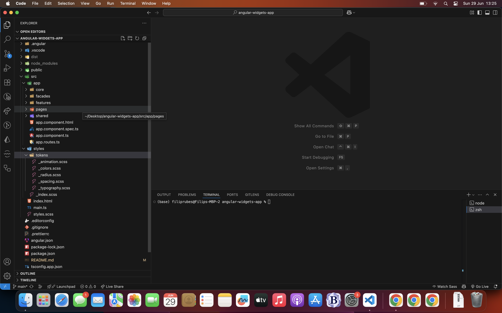

# Angular Widgets App (AWA)

Cilj zadatka je razvoj Angular aplikacije sa interaktivnim widgetima:

- Karta s početnom lokacijom Heinzelova 70
- Lista lokacija
- Tablični i grafički prikaz podataka
- Stranica s prikazom podataka sa [PokéAPI](https://pokeapi.co/)

---

## Korištene tehnologije

- [Angular CLI](https://angular.io/cli): v19.2.7
- TypeScript
- RxJS
- [Leaflet](https://leafletjs.com/)
- [Chart.js](https://www.chartjs.org/)
- [PokéAPI](https://pokeapi.co/)

---

### Instalacija dependencyja

npm install

## Pokretanje aplikacije

npm start

Aplikacija će biti dostupna na adresi `http://localhost:4200/`.

---

## Funkcionalnosti aplikacije

### Karta i lista lokacija

- Prikaz početne lokacije: Heinzelova 70 (Zagreb)
- Lista od 10 lokacija (uzete lokacije kvartova u Zagrebu, ali moze se promijeniti po potrebi)
- Klikom na lokaciju iz liste mijenja se lokacija markera na karti

### Prikaz podataka iz datoteke `podaci.json`

- Učitavanje podataka iz JSON datoteke putem fetcha (simulacija http requesta)
- Prikaz u tablici: originalni 15-minutni podaci
- Grafikon izrađen pomoću Chart.js
- Podaci se transformiraju u satni format uzimanjem prosjeka za svaki sat

### Prikaz podataka s PokéAPI servisa

- Na `/pokemons` ruti dohvaćaju se podaci o Pokémonima (maksimalno 100)
- Paginacija: prikaz 10 Pokémon-a po stranici
- Klikom na red u tablici otvara se detaljan prikaz odabranog Pokémona
- Povratak s detalja vraća korisnika na prethodnu stranicu i isti položaj u paginaciji
- Podaci uključuju: ID, naziv, visinu, težinu, tip i sliku

---

## Struktura projekta

---

## Formatiranje koda

Aplikacija koristi Prettier za automatsko formatiranje koda.
Konfiguracija se nalazi u `.prettierrc` i `.vscode/settings.json` datotekama.

Za ručno formatiranje pokrenuti: npm run format

---

## Testiranje koda

Aplikacija koristi Karma i Jasmine za testiranje Angular komponenti, servisa, direktiva i ostalih modula.

Za ručno izvršavanje testova: npm run test

---
